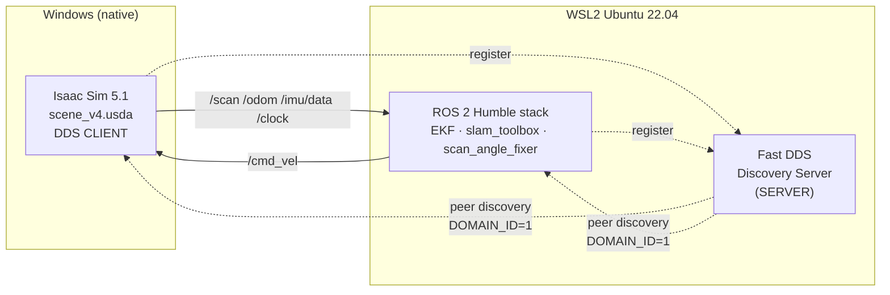
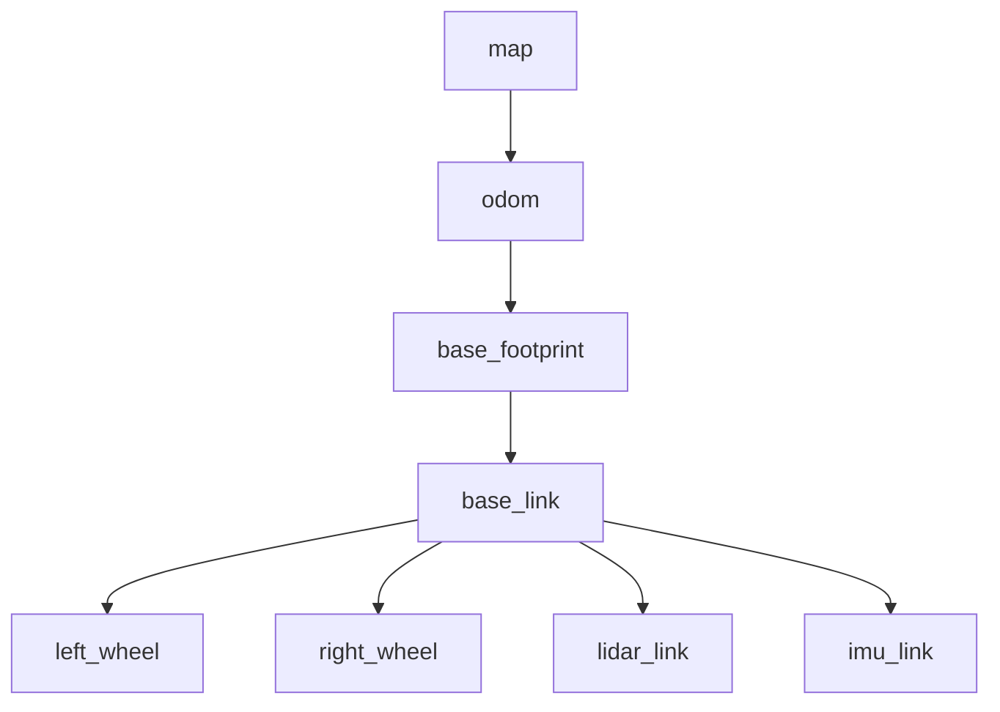
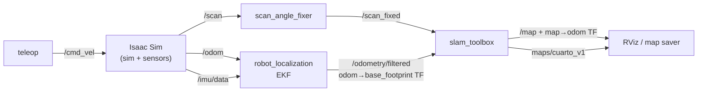

# cargo_bot — Autonomous Indoor Cargo Robot

> A differential-drive autonomous indoor cargo robot for domestic tasks, developed sim-first in NVIDIA Isaac Sim 5.1 with a full ROS 2 Humble stack.

<!-- TODO: add demo GIF -->


-blue)


Repository: <https://github.com/AgustinPrietoValdez/cargo_bot_ws>

---

## Overview

**cargo_bot** is a differential-drive autonomous indoor cargo robot designed for domestic tasks.

**North-star goal:** pick up laundry and deliver it to the laundry room using the building **elevator** — i.e. real multi-floor indoor navigation.

Development is **sim-first**: the robot lives in **NVIDIA Isaac Sim 5.1** (running natively on Windows) and is driven by a **ROS 2 Humble** stack (running in WSL2 Ubuntu 22.04). The two sides are bridged by a **Fast DDS Discovery Server** so that Isaac (the simulator and sensor source) and ROS 2 (perception, localization, mapping, and — soon — navigation) share one DDS graph.

| | |
|---|---|
| **Simulator** | NVIDIA Isaac Sim 5.1 (Windows native) |
| **Middleware** | ROS 2 Humble (WSL2 Ubuntu 22.04), `rmw_fastrtps_cpp` |
| **DDS bridge** | Fast DDS Discovery Server — WSL2 = **SERVER**, Isaac Sim = **CLIENT** |
| **Domain / time** | `ROS_DOMAIN_ID=1`, `use_sim_time=true` (clock from Isaac) |
| **Dev rig** | RTX 4060 Laptop (8 GB VRAM), 16 GB RAM / 16 threads |

For the full development plan, see **[docs/MASTER_PLAN.md](docs/MASTER_PLAN.md)**.

---

## ✨ Current capabilities

All of the following are **verified working** in simulation:

- URDF/Xacro robot model imported into Isaac Sim.
- Isaac scene publishes `/scan`, `/odom`, `/imu/data`, `/clock` and subscribes to `/cmd_vel`.
- RTX 2D LiDAR sensor.
- **robot_localization EKF** fusing wheel odometry + IMU yaw → a clean `odom → base_footprint` TF and `/odometry/filtered`.
- **`scan_angle_fixer` node** that corrects an Isaac RTX-lidar beam-count off-by-one (republishes `/scan` → `/scan_fixed`) so that slam_toolbox / Karto accepts the scan.
- **slam_toolbox 2D SLAM** → saved map `maps/cuarto_v1.{pgm,yaml}` of a ~5.0 × 4.9 m room.
- Manual teleop driving.

---

## 🏗️ Architecture

### Communication: Windows / Isaac ↔ WSL / ROS 2 over Fast DDS



### TF tree



### Node / data-flow graph



### Phase roadmap

```mermaid
gantt
    title cargo_bot development phases
    dateFormat X
    axisFormat %s
    section Done
    Phase 0 DDS Discovery Server        :done, 0, 1
    Phase 1 URDF/Xacro model            :done, 1, 2
    Phase 2 Isaac scene + ROS bridge    :done, 2, 3
    Phase 3 SLAM (IMU+EKF+slam_toolbox) :done, 3, 4
    section In progress
    Phase 4 Nav2 navigation             :active, 4, 5
    section Planned
    Phase 5 Mission orchestration (DSL) :5, 6
    Phase 6 ros2_control + STM32        :6, 7
    Phase 7 Real hardware deployment    :7, 8
```



---

## ✅ Project status

- ✅ **Phase 0** — DDS Discovery Server setup
- ✅ **Phase 1** — URDF/Xacro robot model
- ✅ **Phase 2** — Isaac Sim scene + ROS 2 bridge (OmniGraphs)
- ✅ **Phase 3** — SLAM: IMU + EKF + slam_toolbox + saved map
- 🚧 **Phase 4** — Nav2 autonomous navigation *(in progress)*
- ⏳ **Phase 5** — Mission orchestration (YAML mission DSL)
- ⏳ **Phase 6** — ros2_control + STM32 hardware bring-up
- ⏳ **Phase 7** — Real hardware deployment

---

## 📦 Repository / package structure

```
cargo_bot_ws/
├── config/                       # DDS profiles, boot scripts (launch_all.cmd, source_ros_wsl.sh, …)
├── docs/                         # MASTER_PLAN.md + per-phase guides (Spanish)
├── src/
│   ├── cargo_bot_description/    # URDF/Xacro robot model (chassis, wheels, sensors) + RViz config
│   ├── cargo_bot_simulation/     # Isaac Sim scenes (scene_v4.usda) + setup/diagnostic Python scripts
│   ├── cargo_bot_navigation/     # Configs (ekf.yaml, slam_toolbox.yaml) + saved maps (cuarto_v1)
│   ├── cargo_bot_bringup/        # High-level launch files (slam.launch.py) + scan_angle_fixer node
│   └── cargo_bot_hardware/       # Hardware interface package (future ros2_control / STM32 bring-up)
├── README.md
└── GETTING_STARTED.md
```

**Topics:** `/clock` · `/cmd_vel` · `/odom` · `/imu/data` · `/scan` · `/scan_fixed` · `/odometry/filtered` · `/map` · `/tf`

---

## 🚀 Quickstart

```bash
# 1. Windows: boot Discovery Server (WSL) + Isaac Sim together
config\launch_all.cmd

# 2. Isaac Sim: open scene_v4.usda and press ▶ Play

# 3. WSL: source the environment
cd /mnt/c/Users/agusp/Documentos/cargo_bot_ws
source config/source_ros_wsl.sh
source install/setup.bash

# 4. Verify the bridge
ros2 topic list      # expect: /scan /odom /imu/data /clock /cmd_vel

# 5. Map / navigate
ros2 launch cargo_bot_bringup slam.launch.py
```

👉 Full setup, build, and run instructions are in **[GETTING_STARTED.md](GETTING_STARTED.md)**.

---

## 🗺️ Roadmap

The complete plan lives in **[docs/MASTER_PLAN.md](docs/MASTER_PLAN.md)**.

The **north-star** task is autonomous laundry pickup and delivery to the laundry room **using the building elevator** (multi-floor navigation). Planned roadmap extras toward that goal:

- A gripper to press elevator buttons
- Multi-floor / multi-map navigation
- Person detection
- A safety watchdog
- A Foxglove dashboard

---

## 🔧 Hardware target (future real robot)

| Component | Spec |
|---|---|
| Drive | Differential drive — 2 driven wheels + 1 caster |
| Cargo capacity | 5 kg |
| Battery | LiPo 3S, 11.1 V / 2000 mAh |
| LiDAR | 2D LiDAR (RPLidar A1 / A2) |
| Odometry | Wheel quadrature encoders + IMU (MPU6050 or BNO085) |
| Low-level controller | STM32 (PID, encoders, IMU — C/C++) |
| High-level controller | Raspberry Pi 4 / 5 (ROS 2 Humble) |

---

## 📄 License

MIT (planned).
