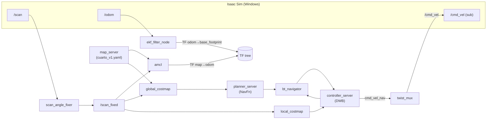

# Fase 4 — Guía Nav2 (Navegación Autónoma)

> **Regla del proyecto:** yo (Claude) escribo esta guía con todos los snippets y el
> porqué de cada parámetro. **Vos** creás los archivos copiando de acá, corrés el
> `colcon build` y la verificación, y operás Isaac.
>
> Decisiones validadas el 2026-05-30 con research-fix contra el branch **Humble**
> de `ros-navigation/navigation2`. Resumen de elecciones:
> - **Controller: DWB** (default Humble, estándar, evasión local real)
> - **Planner: NavFn** (default Humble, sólido, cero tuneo)
> - **Localización: AMCL** con `set_initial_pose` (mapa congelado `cuarto_v1`)
> - **Estrategia incremental en 2 steps:** primero un bringup mínimo que se mueva
>   (sin smoothers), después suavizamos.

---

## 0. Contexto: qué construimos en Fase 4a

Hoy tenemos (Fase 3 ✅): Isaac publica `/scan /odom /imu/data /clock`, el `scan_angle_fixer`
republica `/scan → /scan_fixed`, el EKF (`robot_localization`) publica la TF
`odom → base_footprint` y `/odometry/filtered`, y tenemos un mapa guardado
`cuarto_v1.{pgm,yaml}`.

En Fase 4a sumamos el stack de Nav2:



Las TF quedan así (sin conflicto — cada arista tiene **un solo** publicador):

```
map ──(AMCL)──► odom ──(EKF)──► base_footprint ──► base_link ──► {wheels, lidar_link, imu_link}
```

- **AMCL** publica SOLO `map → odom` (la corrección de localización).
- **EKF** sigue publicando `odom → base_footprint` (no se toca).
- Isaac publica `base_link → {ruedas, sensores}`.

---

## 1. Pre-requisitos (instalar en WSL)

```bash
sudo apt update
sudo apt install -y \
  ros-humble-navigation2 \
  ros-humble-nav2-bringup \
  ros-humble-twist-mux
```

- `ros-humble-navigation2` → el metapackage: trae controller/planner/behavior/bt servers, AMCL, costmaps, lifecycle manager. Incluye DWB, NavFn, MPPI, Smac (todos), así que el swap futuro no requiere instalar nada más.
- `ros-humble-nav2-bringup` → los launch/params de referencia. **Nos sirve para copiar el `nav2_params.yaml` base** y para tener los `navigation_launch.py`/`localization_launch.py` canónicos como referencia.
- `ros-humble-twist-mux` → el multiplexor de `/cmd_vel` (1 input ahora, más en 4b).

Verificá que quedó:

```bash
ros2 pkg prefix nav2_bringup        # debería imprimir un path, no error
ros2 pkg prefix twist_mux
```

---

## 2. Archivos que vas a crear/tocar

```
src/cargo_bot_navigation/config/
├── nav2_params.yaml      ← NUEVO (sección 3)
└── twist_mux.yaml        ← NUEVO (sección 4)

src/cargo_bot_bringup/launch/
└── navigation.launch.py  ← NUEVO (sección 5)
```

- `cargo_bot_navigation/CMakeLists.txt` **ya instala** `config/` y `maps/` (no hay que tocarlo — verificado por el research).
- `cargo_bot_bringup/setup.py` **ya instala** `launch/*.py` (los launch de Fase 3 ya se instalan, así que el glob existe — verificá igual en la sección 5).

---

## 3. `nav2_params.yaml` — bloque por bloque

Creá `src/cargo_bot_navigation/config/nav2_params.yaml`. Te lo doy entero y después
desgloso cada parte. **OJO con los detalles marcados con 👈** — son los que el
research detectó como fáciles de arruinar en *este* setup.

> **El error #1:** el archivo de referencia de Humble trae `robot_base_frame: base_link`
> y `topic: /scan` por default. **Nuestro robot usa `base_footprint` y el scan
> corregido es `/scan_fixed`.** Todos los 👈 son overrides a esos defaults.

### 3.1 — AMCL (localización contra el mapa)

```yaml
amcl:
  ros__parameters:
    use_sim_time: True                # 👈 obligatorio en TODOS los nodos (ver 3.9)
    base_frame_id: "base_footprint"   # 👈 NO base_link — tu URDF usa base_footprint
    odom_frame_id: "odom"
    global_frame_id: "map"
    scan_topic: "/scan_fixed"         # 👈 NO /scan
    set_initial_pose: true            # 👈 AMCL se auto-ubica al arrancar (sim)
    initial_pose:                     # 👈 pose de spawn del robot en coords del mapa
      x: 0.0
      y: 0.0
      z: 0.0
      yaw: 0.0
    # --- params de filtro de partículas (defaults sanos de Humble) ---
    max_particles: 2000
    min_particles: 500
    laser_max_range: 12.0             # alineado con el lidar S2E (~12 m)
    laser_min_range: -1.0             # -1 = usa el range_min del propio scan
    laser_model_type: "likelihood_field"
    max_beams: 60
    alpha1: 0.2                       # ruido rot→rot del modelo de odometría
    alpha2: 0.2                       # ruido trans→rot
    alpha3: 0.2                       # ruido trans→trans
    alpha4: 0.2                       # ruido rot→trans
    alpha5: 0.2                       # ruido strafe (solo holonómico)
    robot_model_type: "nav2_amcl::DifferentialMotionModel"   # 👈 diff-drive
    update_min_a: 0.2                 # rad mínimos de giro para actualizar el filtro
    update_min_d: 0.25                # m mínimos de avance para actualizar
    resample_interval: 1
    transform_tolerance: 1.0
    tf_broadcast: true                # AMCL emite map→odom
    z_hit: 0.5
    z_rand: 0.5
    sigma_hit: 0.2
```

**Por qué:**
- `set_initial_pose + initial_pose`: AMCL **no puede** adivinar dónde estás en todo el
  mapa de cero (kidnapped robot problem). Necesita un empujón inicial. Como en sim el
  robot spawnea siempre en la misma pose, le decimos esa pose acá y la nube de
  partículas nace concentrada ahí. **Acción pendiente:** confirmar la pose real de
  spawn (sección 6.2). Si no es (0,0,0), ajustá estos valores.
- `robot_model_type: DifferentialMotionModel`: tu robot gira en el lugar y avanza, no
  estrafea. El modelo diferencial ignora `alpha5`.
- `scan_topic: /scan_fixed`: si apuntás a `/scan` (1066 vs 1067), AMCL puede rechazar
  o desalinear igual que le pasaba a slam_toolbox.

### 3.2 — `map_server`

```yaml
map_server:
  ros__parameters:
    use_sim_time: True
    yaml_filename: ""    # 👈 lo seteamos desde el launch (path absoluto del install)
    topic_name: "map"
    frame_id: "map"
```

**Por qué:** el default de `yaml_filename` es string vacío → si lo dejás así, el
`map_server` activa pero **sin mapa**. Lo resolvemos en el launch con
`PathJoinSubstitution` al path instalado de `cuarto_v1.yaml` (sección 5), para no
hardcodear `/mnt/c/...`.

### 3.3 — `planner_server` (NavFn)

```yaml
planner_server:
  ros__parameters:
    use_sim_time: True
    expected_planner_frequency: 20.0
    planner_plugins: ["GridBased"]
    GridBased:
      plugin: "nav2_navfn_planner/NavfnPlanner"   # 👈 NavFn
      tolerance: 0.5          # m: si no llega exacto al goal, acepta a 0.5 m
      use_astar: false        # false = Dijkstra (explora parejo). true = A* (más rápido)
      allow_unknown: true     # puede planear a través de celdas "desconocidas"
```

**Por qué:** NavFn es Dijkstra/A* sobre el costmap global. `tolerance: 0.5` evita que
falle el plan cuando el goal cae justo sobre/cerca de inflación. `allow_unknown: true`
es útil en un cuarto donde quedan celdas grises sueltas (ruido del SLAM).

> **Swap futuro a Smac 2D** (si querés paths más suaves): cambiás SOLO este bloque por
> `plugin: "nav2_smac_planner/SmacPlanner2D"`. No toca nada más.

### 3.4 — `controller_server` (DWB)

```yaml
controller_server:
  ros__parameters:
    use_sim_time: True
    controller_frequency: 20.0
    min_x_velocity_threshold: 0.001
    min_y_velocity_threshold: 0.5
    min_theta_velocity_threshold: 0.001
    failure_tolerance: 0.3
    progress_checker_plugin: "progress_checker"
    goal_checker_plugins: ["general_goal_checker"]
    controller_plugins: ["FollowPath"]

    progress_checker:
      plugin: "nav2_controller::SimpleProgressChecker"
      required_movement_radius: 0.5     # si no se mueve 0.5 m en...
      movement_time_allowance: 10.0     # ...10 s → aborta (atascado)

    general_goal_checker:
      stateful: True
      plugin: "nav2_controller::SimpleGoalChecker"
      xy_goal_tolerance: 0.25           # m: cuán cerca del goal cuenta como "llegó"
      yaw_goal_tolerance: 0.25          # rad: tolerancia de heading final

    FollowPath:
      plugin: "dwb_core::DWBLocalPlanner"   # 👈 DWB
      # --- límites de velocidad (BAJADOS de los defaults de TB3) ---
      min_vel_x: 0.0
      max_vel_x: 0.26                   # m/s — robot chico en cuarto chico
      min_vel_y: 0.0
      max_vel_y: 0.0                    # 👈 0 — diff-drive NO estrafea
      max_vel_theta: 1.0                # rad/s
      min_speed_xy: 0.0
      max_speed_xy: 0.26
      min_speed_theta: 0.0
      acc_lim_x: 2.5
      acc_lim_y: 0.0
      acc_lim_theta: 3.2
      decel_lim_x: -2.5
      decel_lim_y: 0.0
      decel_lim_theta: -3.2
      # --- muestreo de trayectorias ---
      vx_samples: 20
      vy_samples: 5
      vtheta_samples: 20
      sim_time: 1.7                     # s de horizonte por trayectoria simulada
      linear_granularity: 0.05
      angular_granularity: 0.025
      transform_tolerance: 0.2
      xy_goal_tolerance: 0.25
      trans_stopped_velocity: 0.25
      short_circuit_trajectory_evaluation: True
      stateful: True
      # --- critics: cómo puntúa cada trayectoria candidata ---
      critics: ["RotateToGoal", "Oscillation", "BaseObstacle", "GoalAlign",
                "PathAlign", "PathDist", "GoalDist"]
      BaseObstacle.scale: 0.02
      PathAlign.scale: 32.0             # ↑ subir esto = sigue más fiel el path (menos pivoteo)
      PathAlign.forward_point_distance: 0.1
      GoalAlign.scale: 24.0
      GoalAlign.forward_point_distance: 0.1
      PathDist.scale: 32.0
      GoalDist.scale: 24.0
      RotateToGoal.scale: 32.0          # critic que hace girar en el lugar al final
      RotateToGoal.slowing_factor: 5.0
      RotateToGoal.lookahead_time: -1.0
```

**Por qué / cómo se relaciona con "no girar en el lugar":**
- DWB simula `vx_samples × vtheta_samples` trayectorias por tick y elige la de mejor
  puntaje según los **critics**. Si querés que pivotee menos en los tramos rectos, el
  botón es subir `PathAlign.scale` (premia ir alineado al path) — pero el pivoteo en
  *esquinas duras* viene del path de NavFn, y eso se ataca mejor con el `smoother_server`
  del **Step 2**, no acá.
- `max_vel_y: 0.0` es **crítico** para diff-drive: si dejás el default holonómico, DWB
  intenta comandos laterales imposibles.
- Bajamos `max_vel_x` a 0.26 m/s: en un cuarto de 5 m no querés que vuele.

> **Swap futuro a MPPI:** reemplazás SOLO el bloque `FollowPath` por la config de
> `nav2_mppi_controller::MPPIController`. Cuidado: en MPPI hay que mantener
> `time_steps × model_dt × vx_max` ≤ radio del local costmap (1.5 m).

### 3.5 — `behavior_server` (recoveries)

```yaml
behavior_server:
  ros__parameters:
    use_sim_time: True
    costmap_topic: local_costmap/costmap_raw
    footprint_topic: local_costmap/published_footprint
    cycle_frequency: 10.0
    behavior_plugins: ["spin", "backup", "drive_on_heading", "assisted_teleop", "wait"]
    spin:
      plugin: "nav2_behaviors/Spin"            # 👈 forma con "/" (Humble), NO "::"
    backup:
      plugin: "nav2_behaviors/BackUp"
    drive_on_heading:
      plugin: "nav2_behaviors/DriveOnHeading"
    wait:
      plugin: "nav2_behaviors/Wait"
    assisted_teleop:
      plugin: "nav2_behaviors/AssistedTeleop"
    global_frame: odom
    robot_base_frame: base_footprint          # 👈 NO base_link
    transform_tolerance: 0.1
    simulate_ahead_time: 2.0
    max_rotational_vel: 1.0
    min_rotational_vel: 0.4
    rotational_acc_lim: 3.2
```

**Por qué:** en Humble los tipos de plugin de behaviors usan la forma `nav2_behaviors/Spin`
(con barra). Si copiás de docs nuevas que usan `nav2_behaviors::Spin` (con `::`),
**no cargan** y el behavior_server no llega a `active`.

### 3.6 — `bt_navigator` (el orquestador de behavior trees)

```yaml
bt_navigator:
  ros__parameters:
    use_sim_time: True
    global_frame: map
    robot_base_frame: base_footprint          # 👈 NO base_link
    odom_topic: /odometry/filtered            # 👈 usamos el output del EKF, no /odom crudo
    bt_loop_duration: 10
    default_server_timeout: 20
    # dejamos default_nav_to_pose_bt_xml VACÍO → usa el BT default de Humble
    # (navigate_to_pose_w_replanning_and_recovery.xml)
    plugin_lib_names:
      - nav2_compute_path_to_pose_action_bt_node
      - nav2_compute_path_through_poses_action_bt_node
      - nav2_smooth_path_action_bt_node
      - nav2_follow_path_action_bt_node
      - nav2_spin_action_bt_node
      - nav2_wait_action_bt_node
      - nav2_assisted_teleop_action_bt_node
      - nav2_back_up_action_bt_node
      - nav2_drive_on_heading_bt_node
      - nav2_clear_costmap_service_bt_node
      - nav2_is_stuck_condition_bt_node
      - nav2_goal_reached_condition_bt_node
      - nav2_goal_updated_condition_bt_node
      - nav2_globally_updated_goal_condition_bt_node
      - nav2_is_path_valid_condition_bt_node
      - nav2_initial_pose_received_condition_bt_node
      - nav2_reinitialize_global_localization_service_bt_node
      - nav2_rate_controller_bt_node
      - nav2_distance_controller_bt_node
      - nav2_speed_controller_bt_node
      - nav2_truncate_path_action_bt_node
      - nav2_truncate_path_local_action_bt_node
      - nav2_goal_updater_node_bt_node
      - nav2_recovery_node_bt_node
      - nav2_pipeline_sequence_bt_node
      - nav2_round_robin_node_bt_node
      - nav2_transform_available_condition_bt_node
      - nav2_time_expired_condition_bt_node
      - nav2_path_expiring_timer_condition
      - nav2_distance_traveled_condition_bt_node
      - nav2_single_trigger_bt_node
      - nav2_goal_updated_controller_bt_node
      - nav2_is_battery_low_condition_bt_node
      - nav2_navigate_through_poses_action_bt_node
      - nav2_navigate_to_pose_action_bt_node
      - nav2_remove_passed_goals_action_bt_node
      - nav2_planner_selector_bt_node
      - nav2_controller_selector_bt_node
      - nav2_goal_checker_selector_bt_node
      - nav2_controller_cancel_bt_node
      - nav2_path_longer_on_approach_bt_node
      - nav2_wait_cancel_bt_node
      - nav2_spin_cancel_bt_node
      - nav2_back_up_cancel_bt_node
      - nav2_assisted_teleop_cancel_bt_node
      - nav2_drive_on_heading_cancel_bt_node
      - nav2_is_battery_charging_condition_bt_node

# 👈 estos DOS nodos hijos necesitan use_sim_time aparte (los más olvidados)
bt_navigator_navigate_through_poses_rclcpp_node:
  ros__parameters:
    use_sim_time: True
bt_navigator_navigate_to_pose_rclcpp_node:
  ros__parameters:
    use_sim_time: True
```

**Por qué:**
- La lista `plugin_lib_names` debe estar **completa** (es la lista canónica de Humble).
  Si falta una entrada que el BT default usa, el bt_navigator no carga el árbol.
- `odom_topic: /odometry/filtered` → el BT lee la velocidad del robot de ahí (para
  nodos tipo "is stuck"). Usamos el output del EKF, que es más limpio que `/odom` crudo.
- Los dos nodos `*_rclcpp_node` corren en wall-clock si no les ponés `use_sim_time`
  explícito → causa errores de TF extrapolation aunque todo lo demás esté en `/clock`.

### 3.7 — `global_costmap`

```yaml
global_costmap:
  global_costmap:                       # 👈 doble anidado a propósito (es real)
    ros__parameters:
      use_sim_time: True
      update_frequency: 1.0
      publish_frequency: 1.0
      global_frame: map
      robot_base_frame: base_footprint  # 👈 NO base_link
      robot_radius: 0.18                # robot ~0.3 m de diámetro → radio ~0.18
      resolution: 0.05                  # = resolución del mapa guardado
      track_unknown_space: true
      plugins: ["static_layer", "obstacle_layer", "inflation_layer"]
      static_layer:
        plugin: "nav2_costmap_2d::StaticLayer"
        map_subscribe_transient_local: True
      obstacle_layer:
        plugin: "nav2_costmap_2d::ObstacleLayer"
        enabled: True
        observation_sources: scan
        scan:
          topic: /scan_fixed            # 👈 NO /scan
          sensor_frame: lidar_link
          data_type: "LaserScan"
          max_obstacle_height: 2.0
          min_obstacle_height: 0.0
          clearing: True
          marking: True
          obstacle_max_range: 5.0       # cap < 12 m del lidar (marca dentro del cuarto)
          obstacle_min_range: 0.0
          raytrace_max_range: 6.0       # ≥ obstacle_max_range (limpia antes de re-marcar)
          raytrace_min_range: 0.0
      inflation_layer:
        plugin: "nav2_costmap_2d::InflationLayer"
        cost_scaling_factor: 3.0
        inflation_radius: 0.35          # 👈 NO el default 0.55 (tapia el cuarto)
      always_send_full_costmap: True
```

### 3.8 — `local_costmap`

```yaml
local_costmap:
  local_costmap:
    ros__parameters:
      use_sim_time: True
      update_frequency: 5.0
      publish_frequency: 2.0
      global_frame: odom
      robot_base_frame: base_footprint  # 👈 NO base_link
      rolling_window: true
      width: 3                          # ventana 3x3 m que sigue al robot
      height: 3
      resolution: 0.05
      robot_radius: 0.18
      plugins: ["obstacle_layer", "inflation_layer"]   # 👈 obstacle_layer, NO voxel_layer
      obstacle_layer:
        plugin: "nav2_costmap_2d::ObstacleLayer"
        enabled: True
        observation_sources: scan
        scan:
          topic: /scan_fixed            # 👈 NO /scan (acá también)
          sensor_frame: lidar_link
          data_type: "LaserScan"
          max_obstacle_height: 2.0
          min_obstacle_height: 0.0
          clearing: True
          marking: True
          obstacle_max_range: 5.0
          obstacle_min_range: 0.0
          raytrace_max_range: 6.0
          raytrace_min_range: 0.0
      inflation_layer:
        plugin: "nav2_costmap_2d::InflationLayer"
        cost_scaling_factor: 3.0
        inflation_radius: 0.35          # 👈 igual que el global
      always_send_full_costmap: True
```

**Por qué de los costmaps (lo crítico):**
- `/scan_fixed` va en **AMBOS** (local Y global). Si te olvidás uno, ese costmap no ve
  obstáculos (o ve datos viejos).
- `inflation_radius: 0.35`: **el parámetro más importante a tunear acá.** El default
  0.55 m en un cuarto de 5 m hace que la inflación desde paredes opuestas se solape en
  el centro → NavFn no encuentra ningún corredor de costo cero → "no valid path".
- El default de Humble para el local costmap usa `voxel_layer` (3D). Como tenés UN solo
  plano de lidar 2D, usamos `obstacle_layer` (2D): más simple y suficiente.
- `obstacle_max_range: 5.0`: el lidar llega a 12 m pero el cuarto mide 5 m; cap a 5-6 m
  evita marcar reflejos "a través" de paredes.

### 3.9 — La regla de oro: `use_sim_time` en TODO

> **El pitfall #1 de Nav2 en sim.** No hay herencia global de `use_sim_time` en Humble:
> hay que setearlo `True` **dentro de cada bloque `ros__parameters`**. Si UN nodo corre
> en reloj de pared mientras el resto corre en `/clock`, las lookups de TF fallan con
> "extrapolation into the future/past" y **el robot no se mueve nunca**.

Ya lo pusimos en cada bloque de arriba. Además, en el launch (sección 5) lo volvemos a
pasar como parámetro a cada nodo (cinturón y tiradores). Nodos que NO te podés olvidar:
`map_server`, `amcl`, `planner_server`, `controller_server`, `behavior_server`,
`bt_navigator`, **`bt_navigator_navigate_to_pose_rclcpp_node`**,
**`bt_navigator_navigate_through_poses_rclcpp_node`**, los dos `lifecycle_manager`, y
`waypoint_follower` si lo agregás.

---

## 4. `twist_mux.yaml` — el multiplexor de cmd_vel

Creá `src/cargo_bot_navigation/config/twist_mux.yaml`:

```yaml
twist_mux:
  ros__parameters:
    use_sim_time: true
    topics:
      navigation:
        topic: cmd_vel_nav     # 👈 entrada de Nav2 (el controller publica acá)
        timeout: 0.5           # s sin mensajes → twist_mux deja de pasar este input
        priority: 10           # mayor número = mayor prioridad
    # En 4b vamos a sumar inputs de mayor prioridad acá:
    #   joystick: { topic: cmd_vel_joy, timeout: 0.5, priority: 100 }
    #   emergency: { topic: cmd_vel_estop, timeout: 0.5, priority: 255 }
```

**Cómo queda el ruteo de cmd_vel (Step 1):**

```
controller_server  ──(remap: cmd_vel → cmd_vel_nav)──►  twist_mux  ──(remap: cmd_vel_out → /cmd_vel)──►  Isaac
```

**Por qué este ruteo (gotcha importante):** el `controller_server` publica en `cmd_vel`
por default, e Isaac escucha en `/cmd_vel`. Si NO remapeás, el controller le escribe
directo a Isaac y el twist_mux queda de adorno (no-op). Por eso:
- remapeamos la salida del controller `cmd_vel → cmd_vel_nav`,
- el twist_mux toma `cmd_vel_nav` y publica en `/cmd_vel` (su salida default es
  `cmd_vel_out`, la remapeamos a `/cmd_vel`).
- Así **twist_mux es el único publicador de `/cmd_vel`** → en 4b metés el e-stop con
  prioridad 255 y pisa a Nav2 sin tocar más nada.

> **Nota Twist vs TwistStamped:** en Humble, Nav2 publica `geometry_msgs/Twist` plano
> (el flag `enable_stamped_cmd_vel` existe pero default `false`), y eso es exactamente
> lo que el subscriber de Isaac espera. **No actives `enable_stamped_cmd_vel`** en ningún
> lado.

---

## 5. `navigation.launch.py`

Creá `src/cargo_bot_bringup/launch/navigation.launch.py`. Levanta los nodos en el orden
correcto con dos `lifecycle_manager` separados (localización y navegación).

```python
import os
from ament_index_python.packages import get_package_share_directory
from launch import LaunchDescription
from launch.actions import DeclareLaunchArgument
from launch.substitutions import LaunchConfiguration, PathJoinSubstitution
from launch_ros.actions import Node
from launch_ros.substitutions import FindPackageShare


def generate_launch_description():
    nav_share = get_package_share_directory('cargo_bot_navigation')

    use_sim_time = LaunchConfiguration('use_sim_time')
    params_file = LaunchConfiguration('params_file')
    map_yaml = LaunchConfiguration('map')

    declare_use_sim_time = DeclareLaunchArgument(
        'use_sim_time', default_value='true',
        description='Usar /clock de Isaac')

    declare_params = DeclareLaunchArgument(
        'params_file',
        default_value=os.path.join(nav_share, 'config', 'nav2_params.yaml'),
        description='Ruta al nav2_params.yaml')

    declare_map = DeclareLaunchArgument(
        'map',
        default_value=os.path.join(nav_share, 'maps', 'cuarto_v1.yaml'),
        description='Ruta al mapa')

    # Nodos que maneja el lifecycle_manager de LOCALIZACIÓN
    localization_nodes = ['map_server', 'amcl']

    # Nodos que maneja el lifecycle_manager de NAVEGACIÓN
    # ⚠️ el ORDEN importa: controller primero, bt_navigator después de sus servers
    navigation_nodes = [
        'controller_server',
        'planner_server',
        'behavior_server',
        'bt_navigator',
        'waypoint_follower',
    ]

    # ---------- LOCALIZACIÓN ----------
    map_server = Node(
        package='nav2_map_server', executable='map_server', name='map_server',
        output='screen',
        parameters=[params_file,
                    {'use_sim_time': use_sim_time, 'yaml_filename': map_yaml}])

    amcl = Node(
        package='nav2_amcl', executable='amcl', name='amcl',
        output='screen',
        parameters=[params_file, {'use_sim_time': use_sim_time}])

    lifecycle_localization = Node(
        package='nav2_lifecycle_manager', executable='lifecycle_manager',
        name='lifecycle_manager_localization', output='screen',
        parameters=[{'use_sim_time': use_sim_time,
                     'autostart': True,
                     'node_names': localization_nodes}])

    # ---------- NAVEGACIÓN ----------
    controller_server = Node(
        package='nav2_controller', executable='controller_server', name='controller_server',
        output='screen',
        parameters=[params_file, {'use_sim_time': use_sim_time}],
        remappings=[('cmd_vel', 'cmd_vel_nav')])   # 👈 salida del controller → twist_mux

    planner_server = Node(
        package='nav2_planner', executable='planner_server', name='planner_server',
        output='screen',
        parameters=[params_file, {'use_sim_time': use_sim_time}])

    behavior_server = Node(
        package='nav2_behaviors', executable='behavior_server', name='behavior_server',
        output='screen',
        parameters=[params_file, {'use_sim_time': use_sim_time}])

    bt_navigator = Node(
        package='nav2_bt_navigator', executable='bt_navigator', name='bt_navigator',
        output='screen',
        parameters=[params_file, {'use_sim_time': use_sim_time}])

    waypoint_follower = Node(
        package='nav2_waypoint_follower', executable='waypoint_follower', name='waypoint_follower',
        output='screen',
        parameters=[params_file, {'use_sim_time': use_sim_time}])

    lifecycle_navigation = Node(
        package='nav2_lifecycle_manager', executable='lifecycle_manager',
        name='lifecycle_manager_navigation', output='screen',
        parameters=[{'use_sim_time': use_sim_time,
                     'autostart': True,
                     'node_names': navigation_nodes}])

    # ---------- TWIST MUX ----------
    twist_mux = Node(
        package='twist_mux', executable='twist_mux', name='twist_mux',
        output='screen',
        parameters=[os.path.join(nav_share, 'config', 'twist_mux.yaml'),
                    {'use_sim_time': use_sim_time}],
        remappings=[('cmd_vel_out', '/cmd_vel')])  # 👈 salida del mux → Isaac

    return LaunchDescription([
        declare_use_sim_time, declare_params, declare_map,
        map_server, amcl, lifecycle_localization,
        controller_server, planner_server, behavior_server,
        bt_navigator, waypoint_follower, lifecycle_navigation,
        twist_mux,
    ])
```

**Por qué:**
- **Dos lifecycle managers**: Nav2 separa localización (`map_server`, `amcl`) de
  navegación (los servers). Cada uno con `autostart: True` para que arranquen solos.
- **El orden de `navigation_nodes` importa**: `controller_server` primero, `bt_navigator`
  después de los servers que invoca. Orden equivocado → algún nodo no llega a `active`.
- `waypoint_follower` no lo vamos a usar en el primer goal, pero está en la lista
  lifecycle estándar; lo dejamos para no romper expectativas (es liviano).
- **NO** levantamos acá el EKF ni el robot_state_publisher: eso ya viene de
  `slam.launch.py` / `localization.launch.py`. Si lo duplicás, tenés dos publicadores de
  `odom → base_footprint` peleándose.

> **Verificá el `setup.py` de `cargo_bot_bringup`:** que tenga el glob de launch, algo como
> `(os.path.join('share', package_name, 'launch'), glob('launch/*.py'))` en `data_files`.
> Como `slam.launch.py` ya se instala, debería estar. Si no, agregalo.

---

## 6. Build, boot y verificación (Step 1)

### 6.1 — Build

```bash
cd /mnt/c/Users/agusp/cargo_bot_ws
colcon build --packages-select cargo_bot_navigation cargo_bot_bringup
source install/setup.bash
```

### 6.2 — Confirmar la pose de spawn (para `initial_pose` de AMCL)

Con Isaac corriendo `scene_v4.usda` ▶ Play y `slam.launch.py` activo (de Fase 3):

```bash
ros2 run tf2_ros tf2_echo map base_footprint
```

Anotá la traslación `(x, y)` y el yaw. Si NO es ~(0,0,0), poné esos valores en
`amcl.initial_pose` (sección 3.1) y rebuildeá. (Para Nav2 no necesitás SLAM corriendo;
SLAM acá es solo para leer la pose una vez.)

### 6.3 — Boot de Fase 4

```bash
# 1) Isaac (Windows): launch_all.cmd → abrir scene_v4.usda → ▶ Play
# 2) WSL terminal A — bringup base (scan_fixer + EKF + RSP, SIN slam_toolbox):
#    (si tu slam.launch.py arranca slam_toolbox, hacé un launch base o comentá esa parte;
#     Nav2 trae su propia localización con AMCL, NO querés slam_toolbox al mismo tiempo)
source config/source_ros_wsl.sh
source install/setup.bash

# 3) WSL terminal B — Nav2:
ros2 launch cargo_bot_bringup navigation.launch.py
```

> ⚠️ **No corras slam_toolbox y AMCL al mismo tiempo**: ambos quieren publicar `map → odom`.
> En Fase 4 la localización la hace AMCL. Necesitás que sigan vivos: `scan_angle_fixer`,
> el EKF, y el robot_state_publisher (la TF `base_link→sensores` viene de Isaac).

### 6.4 — Verificación (en orden)

```bash
# a) Datos crudos llegan
ros2 topic echo /scan_fixed --once     # ranges con valores, no todo inf/0
ros2 topic hz /clock                   # ~ rate de Isaac

# b) Todos los nodos lifecycle llegaron a "active"
ros2 lifecycle get /map_server         # → active
ros2 lifecycle get /amcl               # → active
ros2 lifecycle get /controller_server  # → active
ros2 lifecycle get /planner_server     # → active
ros2 lifecycle get /behavior_server    # → active
ros2 lifecycle get /bt_navigator       # → active
# Si alguno queda en "unconfigured"/"inactive" → orden del lifecycle_manager
# o use_sim_time mal en ese nodo.

# c) TF tree limpio: UN publicador por arista
ros2 run tf2_tools view_frames
# Abrí el PDF: map→odom (authority amcl), odom→base_footprint (authority ekf_filter_node),
# base_footprint→base_link→sensores. Sin duplicados.

# d) cmd_vel sale del mux, no del controller directo
ros2 topic info /cmd_vel               # publisher = twist_mux
```

### 6.5 — Mandar un goal en RViz

1. Abrí RViz con `cargo_bot.rviz` (ya tiene configurado "2D Goal Pose" → `/goal_pose`).
2. **Fixed Frame = `map`**.
3. Deberías ver: el mapa (`/map`), el costmap, y la nube de partículas de AMCL.
4. Como usamos `set_initial_pose`, la nube ya debería estar concentrada en el robot. Si
   no, usá el botón **"2D Pose Estimate"** una vez.
5. Botón **"2D Goal Pose"** → clickeá un destino en el mapa → el robot debería planear
   (línea) y navegar sin chocar.

**✅ Done de Step 1 (= Fase 4a):** goal en RViz → el robot llega sin chocar, en escena
limpia (sin obstáculos dinámicos).

---

## 7. Step 2 — Suavizado (después de verificar Step 1)

Si en Step 1 el robot llega pero pivotea mucho o va a tirones, sumamos suavizado.
Son dos piezas independientes:

### 7.1 — `smoother_server` (suaviza el PATH global)

Es lo que más reduce los giros en esquinas. Agregá a `nav2_params.yaml`:

```yaml
smoother_server:
  ros__parameters:
    use_sim_time: True
    smoother_plugins: ["simple_smoother"]
    simple_smoother:
      plugin: "nav2_smoother::SimpleSmoother"
      tolerance: 1.0e-10
      max_its: 1000
      do_refinement: True
```

Y agregá `'smoother_server'` a `navigation_nodes` en el launch (después de
`planner_server`). El BT default de Humble ya tiene el nodo `SmoothPath` listo para
usarlo.

### 7.2 — `velocity_smoother` (suaviza el CMD_VEL de salida)

Suaviza aceleraciones bruscas en el comando final. Agregá a `nav2_params.yaml`:

```yaml
velocity_smoother:
  ros__parameters:
    use_sim_time: True
    smoothing_frequency: 20.0
    scale_velocities: False
    feedback: "OPEN_LOOP"
    max_velocity: [0.26, 0.0, 1.0]
    min_velocity: [-0.26, 0.0, -1.0]
    max_accel: [2.5, 0.0, 3.2]
    max_decel: [-2.5, 0.0, -3.2]
    odom_topic: "/odometry/filtered"
    odom_duration: 0.1
```

**Re-ruteo de cmd_vel con velocity_smoother** (cambia el remap del controller y se suma
un nodo):

```
controller ─(cmd_vel→cmd_vel_nav_raw)→ velocity_smoother ─(cmd_vel_smoothed)→ twist_mux ─(/cmd_vel)→ Isaac
```

- El `velocity_smoother` suscribe `cmd_vel` y publica `cmd_vel_smoothed`. Hay que
  remapear: controller `cmd_vel → cmd_vel` (que lo lea el smoother), smoother salida
  `cmd_vel_smoothed`, y twist_mux input = `cmd_vel_smoothed`.
- Agregá `'velocity_smoother'` a `navigation_nodes` y actualizá `twist_mux.yaml` para que
  el input `navigation.topic` sea `cmd_vel_smoothed`.

Re-verificá igual que en 6.4-6.5. Si quedó suave → Fase 4a + suavizado cerrados.

---

## 8. Troubleshooting

| Síntoma | Causa probable | Fix |
|---|---|---|
| El robot nunca se mueve, logs con "extrapolation into the future/past" | Falta `use_sim_time: True` en algún nodo (típico: los `bt_navigator_*_rclcpp_node`) | Revisá sección 3.9 |
| `ros2 lifecycle get` da `unconfigured`/`inactive` | Orden del `lifecycle_manager` mal, o el nodo crasheó al cargar un plugin | Mirá el log del nodo; chequeá `plugin_lib_names` completo y forma `nav2_behaviors/...` |
| "No valid path" siempre | `inflation_radius` muy alto tapia el cuarto | Bajá a 0.35 (o menos); verificá que el costmap no esté todo inflado en RViz |
| El costmap no muestra obstáculos | El obstacle layer apunta a `/scan` en vez de `/scan_fixed` | Corregí en AMBOS costmaps (3.7 y 3.8) |
| El robot se mueve pero ignora al twist_mux | El controller publica directo a `/cmd_vel` (falta el remap) | Remap `cmd_vel → cmd_vel_nav` en el controller (sección 5) |
| AMCL nunca converge / robot "salta" en el mapa | `initial_pose` mal, o `scan_topic` apunta a `/scan` | Confirmá pose de spawn (6.2); usá `/scan_fixed` |
| Topics no aparecen | Discovery Server / DOMAIN_ID | `source config/source_ros_wsl.sh`; `ROS_DOMAIN_ID=1`; Discovery Server vivo |
| Todo andaba y de golpe se rompió tras Stop/Play en Isaac | Stop/Play resetea `/clock` y mata el EKF | Ctrl+C + relanzar el bringup y Nav2 |

---

## 9. Decisiones abiertas (para vos)

1. **Pose de spawn**: confirmar `initial_pose` real (sección 6.2). Default asumido (0,0,0).
2. **Footprint**: arrancamos con `robot_radius: 0.18` (círculo, simple). Si la base es
   más rectangular y roza, pasamos a `footprint` poligonal.
3. **`obstacle_max_range`**: 5.0 vs 6.0 — según si querés marcar todo el cuarto desde una
   sola pose.
4. **Cuándo hacer Step 2**: solo si el movimiento de Step 1 te molesta. Si ya va bien,
   salteamos el suavizado por ahora.

---

## 10. Qué viene después (Fase 4b — safety, NO en esta guía)

Con Nav2 limpio y estable, recién ahí van las capas de seguridad (por algo está
splitteado en 4a/4b): geofencing, collision shield, watchdog, tip-over, battery sim.
El `twist_mux` ya quedó preparado con prioridades para meter el e-stop encima sin
refactor. Ver MASTER_PLAN §8 Fase 4b.

---

*Guía escrita 2026-05-30. Stack validado contra el branch Humble de Nav2. Fuentes
principales: `nav2_bringup/params/nav2_params.yaml` (Humble), docs.nav2.org (Humble),
robot_localization, twist_mux.*
